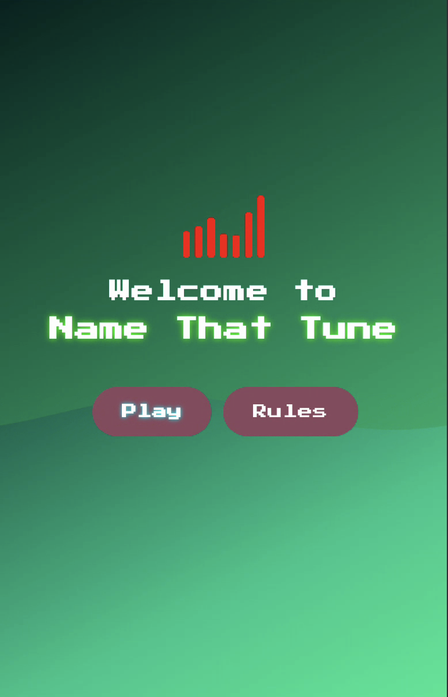

# NameTunes

**NameTunes** is a music-based trivia app that tests your ability to identify songs based on short audio snippets. Players are presented with a song clip and must guess the correct track from a list of multiple choices.

---

## Features

- **Music Quiz Gameplay**: Guess the song from an audio snippet.
- **Leaderboard**: View the highest scores based on gameplay.
- **Multiple Genres**: Play the game with different music genres.
- **User-Friendly Interface**: 

---

## Screenshots


*(Replace with your actual screenshot path)*

---

## Technologies Used

- **Kotlin** (for app development)
- **Express.js** (for the backend)
- **PostgreSQL** (for storing data like scores)
- **Deezer API** (to fetch random songs and their details)

---

## Getting Started

1. **Clone the repository**:

    ```bash
    git clone https://github.com/your-username/nametunes.git
    cd nametunes
    ```

2. **Install dependencies**:

    - Make sure you have **Android Studio** installed.
    - Open the project in Android Studio.

3. **Run the app**:
    - Connect your Android device or start an emulator.
    - Click **Run** in Android Studio.

---

## Setup Instructions

### Backend Setup

1. **Express.js Setup**:
    - Ensure you have **Node.js** installed.
    - Run `npm install` in the backend directory to install required dependencies.
    - Set up a **PostgreSQL database** and ensure your **.env** file contains the correct database credentials.
    - Run the backend server using `npm start`.

2. **Deezer API**:
    - Set up your Deezer API credentials and ensure they're properly integrated in your app to fetch song details.

---

## Contributing

If you would like to contribute to this project, feel free to fork the repository and submit a pull request. Any contributions are welcome!

---

## License

This project is licensed under the MIT License - see the [LICENSE](LICENSE) file for details.
